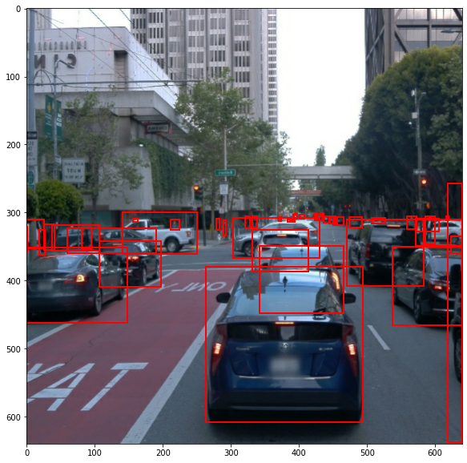
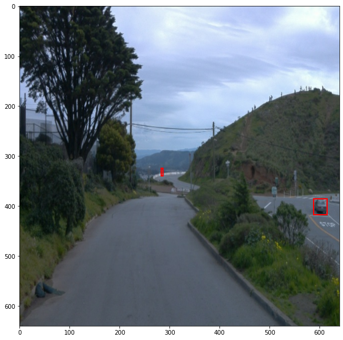
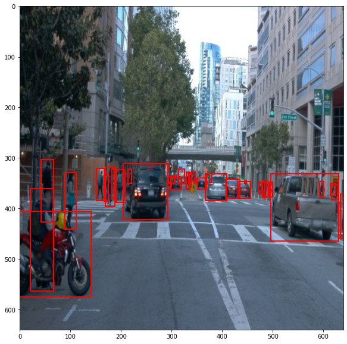
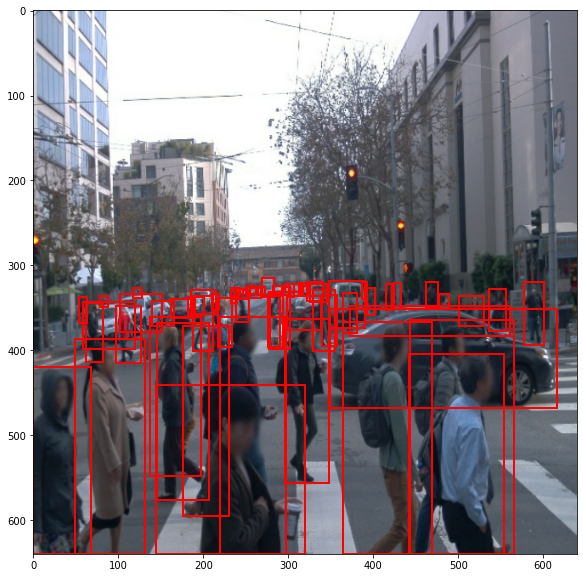
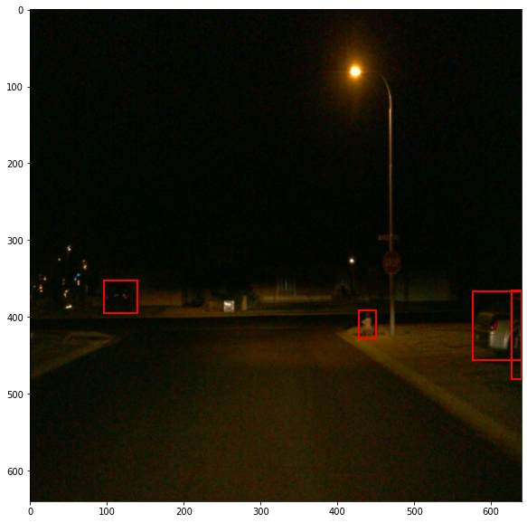
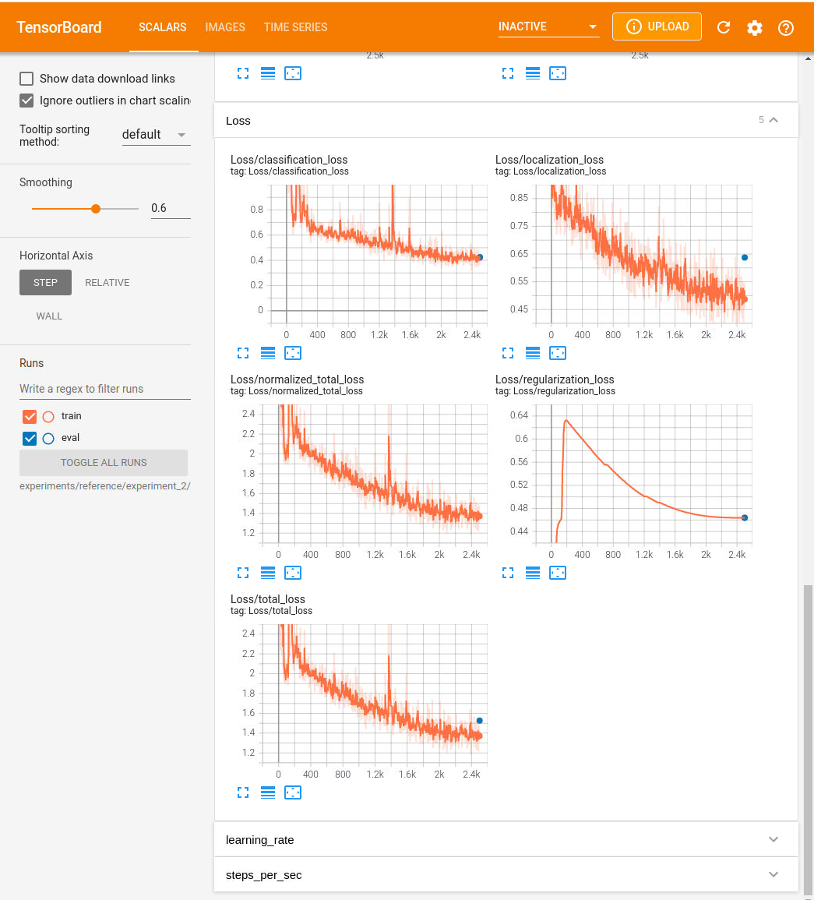

# Object Detection in an Urban Environment

### Data Science Nanodegree - Computer vision chapter from Udacity


## Table of Contents

1. [Project Description](#description)
2. [Getting Started](#getting_started)
   1. [Dependencies](#dependencies)
   2. [Installation](#installation)
   3. [Execution & Instruction](#execution)

3. [Authors](#authors)
4. [License](#license)
5. [Acknowledgement](#acknowledgement)


<a name="descripton"></a>
## Description


This Project is part of Data Science Nanodegree Program by Udacity. The goal of the project is to deploy a model with different hyperparameters and augmentations to train a neural network for detecting and classifying objects which is one of the crucial subject in autonomous driving. This deployment is done using tensorflow object detection API for detecting 3 classes of vehicles, pedestrians and cyclists.


This project is divided in the following sections:

## File Description
~~~~~~~
        object-detection-in-an-urban-environment
        |-- data                                            #tfrecord sample files for object detection api format
                |-- test
                |-- val
                |-- train
        |-- examples                                        # example urban images containing their bounding boxes
                |-- training_examples
                |-- validation examples
        |-- experiments
                |-- exporter_main_v2.py                     # tool for exporting object detection inference
                |-- label_map.pbtxt                         # label of the classes
                |-- model_main_tf2.py                       # model for launching a training
                |-- reference
                        |-- experiment_1
                                |-- pipeline_new.config     # api config for 1st run
                        |-- experiment_2
                                |-- pipeline.config         # api config for 2st run
                        |-- experiment_3
                                |-- pipeline_new.config     # api config for 3rd run
                        |-- exported
                                |-- saved_model
                                        |-- saved_model.pb  # tensorflow SavedModel format
                                |-- pipeline.config
        |-- animation.gif                                   # script for making an animation
        |-- edit_config.py
        |-- Exploratory Data Analysis.ipynb                 # EDA notebook for exploring the data
        |-- Explore augmentations.ipynb                     # augmentation notebook for exploring optimal required augmentations
        |-- filenames.txt
        |-- inference_video.py
        |-- launch_jupyter.sh                               # script for running jupyter from linux in classroom environment
        |-- requirements.txt
        |-- utils.py
        |-- README.md
~~~~~~~


## Data

The dataset presented in this project is from [Waymo Open dataset](https://waymo.com/open/) and contains of urban environments images.

[OPTIONAL] - The files can be downloaded directly from the website as tar files or from the [Google Cloud Bucket](https://console.cloud.google.com/storage/browser/waymo_open_dataset_v_1_2_0_individual_files/) as individual tf records. We have already provided the data required to finish this project in the workspace, so you don't need to download it separately.

These images then will be used for training, validation and testing and they are located in below:
```
data\train: which contains of 86 tfrecorf files
data\val: which has 10 tfrecord files
data\test: which contains of 3 tfrecord files
```

<a name="getting_started"></a>
## Getting Started


<a name="dependencies"></a>
### Dependencies
* Python 3.8+
* Visualization: matplotlib
* Model training: tensorflow
* Extra: numpy


<a name="installation"></a>
### Installation
To clone the git repository:
```
git clone https://github.com/fuzhanrahmanian/Object_detection_in_an_urban_environment.git
```

#### Local Setup

In the following Udacity provided an instruction for users who want to run this project locally:

For local setup if you have your own Nvidia GPU, you can use the provided Dockerfile and requirements in the [build directory](./build).

Follow [the README therein](./build/README.md) to create a docker container and install all prerequisites.

##### Download and process the data

The first goal of this project is to download the data from the Waymo's Google Cloud bucket to your local machine. For this project, we only need a subset of the data provided (for example, we do not need to use the Lidar data). Therefore, we are going to download and trim immediately each file. In `download_process.py`, you can view the `create_tf_example` function, which will perform this processing. This function takes the components of a Waymo Tf record and saves them in the Tf Object Detection api format. An example of such function is described [here](https://tensorflow-object-detection-api-tutorial.readthedocs.io/en/latest/training.html#create-tensorflow-records). We are already providing the `label_map.pbtxt` file.

You can run the script using the following command:
```
python download_process.py --data_dir {processed_file_location} --size {number of files you want to download}
```

You are downloading 100 files (unless you changed the `size` parameter) so be patient! Once the script is done, you can look inside your `data_dir` folder to see if the files have been downloaded and processed correctly.

#### Classroom Workspace

In the classroom workspace all the the necessary packages and libraries are already installed in the environment. Additionally, data required for this project is also already provided.

**Note** This project contains of 2 jupyter notebooks. Launching these notebooks can only be done with the Desktop workspace. To do so, you are required to open the terminal of your Desktop workspace and follow the below commands:
```
cd /home/workspace
jupyter notebook --port 3002 --ip=0.0.0.0 --allow-root
```
Alternatively you can run `./launch_jupyter.sh` in the workspace directory.


<a name="execution"></a>
### Execution and Instructions:

Following steps should be taken into account in order to run and complete the project.

#### Step 1:: Exploratory Data Analysis (EDA)
Exploring the dataset can be accomplished in this jupyter notebook. By displaying the images, we can get an overall picture about the data available in `data\` folder. Another task that we are having in this notebook is to create color-coded bounding boxes and annotate them for each class object using `matplotlib` library. In this work, red correspondent to vehicles, blue to pedestrians and green for cyclist class.

<p float="left">
  
  
  
</p>

<p float="left">
  
  
  
</p>

As can be seen in the images above, these dataset contains of various weather conditions (rainy, foggy, sunny, cloudy), different places (autobahn, city, main street, one way street and etc.) and different time zones (day, night, midday). Due to these differences, each image has different amount of light, bluriness and contrasts.
Some random images from train and validation dataset are saved in folder `examples\training_examples` and `examples\validation_examples`.

Additionally, in order to study the distribution between different objects, a bar chart below is provided. It is observable, vehicles are appeared the most while cyclists occupied very small portion of the dataset.


As a class imbalanced can be seen in the data distribution, it can be suggested to apply some oversampling techniques (i.e. augmentation using generative models) in order model can learn and generalize better and subsequently give more accurate and reliable predictions.

#### Step 2: download the pretrained model and edit the config file.

For this project, we are using Single Shot Detector (SSD) ResNet 50 640x640 model. Therefore, we need to download the pretrained model.

First, we need to change the directory.

```
cd /home/workspace/experiments/pretrained_model/
```

Then, by running the commands below, the pretrained SSD model can be downloaded.

```
wget http://download.tensorflow.org/models/object_detection/tf2/20200711/ssd_resnet50_v1_fpn_640x640_coco17_tpu-8.tar.gz

tar -xvzf ssd_resnet50_v1_fpn_640x640_coco17_tpu-8.tar.gz

rm -rf ssd_resnet50_v1_fpn_640x640_coco17_tpu-8.tar.gz

```
#### Step3: Training
The first training can be launch by the following command:
```
python experiments/model_main_tf2.py --model_dir=experiments/reference/experiment_1/ --pipeline_config_path=experiments/reference/experiment_1/pipeline_new.config
```
Once the training is done, you can launch the evaluation. Due to limitation in workspace storage, the evaluation scripts ran for just one epoch.

```
python experiments/model_main_tf2.py --model_dir=experiments/reference/experiment_1/ --pipeline_config_path=experiments/reference/experiment_1/pipeline_new.config --checkpoint_dir=experiments/reference/experiment_1/
```


By using tensorboard the training as well as evaluation process can be monitored. By using the below command and copying the address in your web browser, you can see the trends.

```
python -m tensorboard.main --logdir experiments/reference/experiment_1/
```


In the image above, the loss trend of the training is shown in orange and one epoch of evaluation can be seen with a blue dot.
In normalized total loss value, it can be seen, the diagram did not completely reach to a Plateau and loss values fluctuated considerably during the training. Additionally, one epoch of evaluation is almost on the curve of the training loss. It is possible that we are having underfitting. In order to improve the model performance, we can increase the epoch numbers and as the chance of overfitting might increase then it is suggested to add some augmentations. In order to apply suitable augmentation methods available in  `preprocessor.proto` from Tf object detection API, we will work on the provided jupyter notebook `Explore augmentations.ipynb`.


The techniques that considered for improving the model performance are adjusting the contrast between 0.7 to 1.1, adjusting brightness with the max delta of 0.4, adjusting saturation between 0.6 to 1.1 and applying grayscale conversion with the probability of 0.15 as we are having dark, blended edges, and not vivid scenes. These modifications can be found in `experiments/reference/experiment_2/pipeline.config` file.

<p float="left">
  
  
  
</p>

<p float="left">
  
  
  
</p>

After retraining, it can be seen that the loss in compare to the previous non-augmentaed model, significantly decreases (i.e. total and regaularization loss decreases from 5.5 to 1.4 and 4.4 to 0.48 respectively). Additionally, less flactuations can be seen in all various losses (classification, localization and total). In overall an improvement in model training can be seen. However, it is visible that the one epoch evaluation loss slightly diverge from the training loss which indicate a bit of overfitting. As it was mentioned at the beginning, the dataset in unbalanced and oversampling might improve the model generalization and performance as well as decreasing further (i.e. adding more samples with pedestrians and cyclists)




## Author

* [Fuzhan Rahmanian](https://github.com/fuzhanrahmanian)

<a name="license"></a>

## License

[](https://opensource.org/licenses/MIT)

<a name="acknowledgement"></a>

## Acknowledgements

* [Udacity](https://www.udacity.com/) for providing Data Science Nanodegree Program and this project.
* [Waymo Open dataset](https://waymo.com/open/) for providing the urban environments dataset containing annotated cyclists, pedestrians and vehicles.
* [Bosch GmbH](https://www.bosch.de/) for sponsoring this Nanodegree.

<a name="Application"></a>
